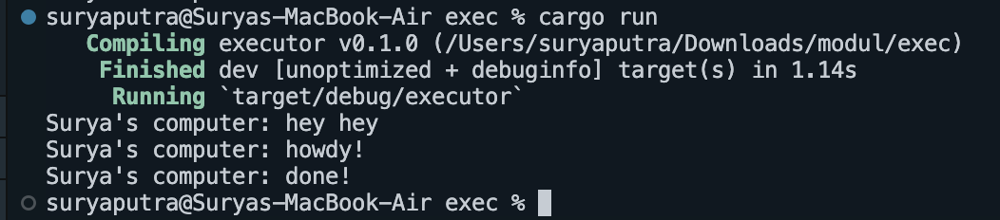

Dari hasil pengamatan output yang dihasilkan dari eksekusi program, dapat disimpulkan bahwa terdapat penggunaan asinkron dalam program tersebut. Dapat dilihat "hey hey" muncul pertama kali dalam output, yang berarti bahwa baris kode yang mencetak "hey hey" dieksekusi terlebih dahulu secara sinkron di thread utama. Kemudian, jika kita asumsikan bahwa "howdy!" dan "done!" dihasilkan oleh task asinkron, kedua output tersebut muncul setelah "hey hey" karena task tersebut masih dalam antrian eksekusi oleh executor yang bertanggung jawab menjalankan operasi asinkron.

Pada kasus ini, urutan eksekusi outputnya adalah sebagai berikut:
"Surya's computer: hey hey" muncul pertama kali karena perintah println!("Surya's computer: hey hey"); dijalankan secara langsung di fungsi main() yang bersifat sinkron. Perintah ini dieksekusi dan selesai sebelum program mengalihkan kontrol ke executor yang menangani task asinkron.

Setelah perintah cetak pertama, spawner yang telah diinisialisasi sebelumnya digunakan untuk memasukkan sebuah task asinkron ke dalam antrian eksekutor. Task ini mencetak "Surya's computer: howdy!" segera setelah dimulai, dan kemudian menunggu selama dua detik sebelum mencetak "Surya's computer: done!".

Executor baru dijalankan setelah spawner di-drop, yang merupakan indikasi bahwa tidak akan ada task baru yang masuk, memaksa executor untuk mulai menjalankan task yang telah di-spawn. Inilah sebabnya mengapa output "howdy!" dan "done!" muncul setelah "hey hey", meskipun task asinkron dimulai sebelum println!("Surya's computer: hey hey"); dijalankan.